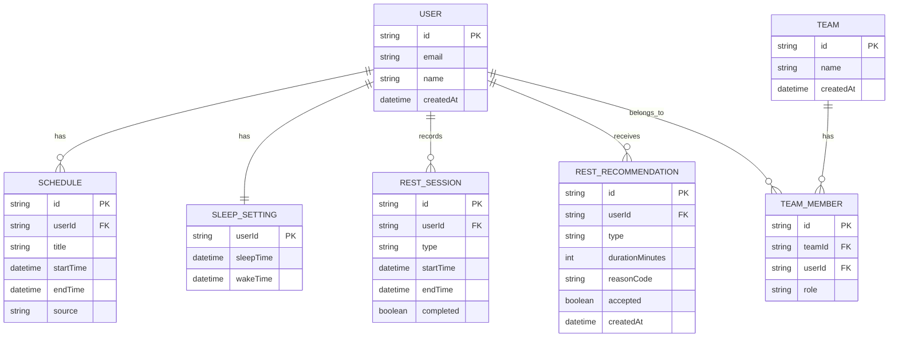

# Team Nap データベース設計

## 1. 概要

Team Napでは、ユーザーのスケジュール、睡眠設定、休息履歴、AIによる休息提案、チーム情報などを保存するために **PostgreSQL** を使用します。

ORMには **Prisma** を使用し、Backend API からのみデータベースへアクセスします。

```text
Mobile App
   |
   | REST API / JSON
   v
Backend API
   |
   | Prisma
   v
PostgreSQL
```

Mobile App から PostgreSQL へ直接アクセスすることはありません。

---

## 2. 使用技術

| 項目      | 技術                           |
| --------- | ------------------------------ |
| Database  | PostgreSQL 17                  |
| ORM       | Prisma                         |
| Backend   | Node.js + Express + TypeScript |
| Container | Docker / Docker Compose        |
| Migration | Prisma Migrate                 |

---

## 3. 関連ファイル

Databaseに関する主要ファイルは以下です。

```text
backend/
├── prisma/
│   ├── schema.prisma
│   └── migrations/
├── prisma.config.ts
├── src/
│   └── lib/
│       └── prisma.ts
└── .env
```

### `backend/prisma/schema.prisma`

データベースのモデル定義を記述します。

### `backend/prisma/migrations/`

Prisma Migrateによって生成されたMigrationを保存します。

このディレクトリは **Gitで管理します**。

### `backend/prisma.config.ts`

Prisma CLIの設定ファイルです。

Database URLやMigration pathなどを管理します。

### `backend/src/lib/prisma.ts`

Backend内で使用するPrisma Clientを初期化するファイルです。

---

## 4. 初期ER図



---

## 5. テーブル概要

### User

ユーザーの基本情報を保存します。

主な用途:

- ログインユーザーの識別
- Scheduleとの紐付け
- Sleep Settingとの紐付け
- Rest Sessionとの紐付け
- Team Memberとの紐付け

想定項目:

```text
id
email
name
createdAt
```

---

### Schedule

ユーザーの予定を保存します。

想定項目:

```text
id
userId
title
startTime
endTime
source
```

`source`には、例えば以下の値を想定します。

```text
manual
google_calendar
apple_calendar
```

MVPでは `manual` のみでも問題ありません。

---

### SleepSetting

ユーザーの基本的な睡眠時間を保存します。

想定項目:

```text
userId
sleepTime
wakeTime
```

1ユーザーにつき1件を基本とするため、`userId`を一意にします。

---

### RestSession

実際に行った休息を記録します。

想定項目:

```text
id
userId
type
startTime
endTime
completed
```

`type`の例:

```text
nap
break
coffee
```

---

### RestRecommendation

AIまたはルールベースで生成された休息提案を保存します。

想定項目:

```text
id
userId
type
durationMinutes
reasonCode
accepted
createdAt
```

`reasonCode`の例:

```text
LOW_SLEEP
LONG_WORK_PERIOD
FREE_TIME_AVAILABLE
HIGH_FATIGUE
```

将来的には、ユーザーが提案を受け入れたかどうかを分析し、個人最適化に利用します。

---

### Team

チーム情報を保存します。

想定項目:

```text
id
name
createdAt
```

---

### TeamMember

UserとTeamを関連付ける中間テーブルです。

想定項目:

```text
id
teamId
userId
role
```

同じユーザーが同じTeamへ重複登録されないように、以下の組み合わせはUnique Constraintにする想定です。

```text
teamId + userId
```

---

## 6. Prisma Schemaの例

初期段階では、以下のようなモデルから開始できます。

```prisma
generator client {
  provider = "prisma-client-js"
}

datasource db {
  provider = "postgresql"
}

model User {
  id                  String               @id @default(uuid())
  email               String               @unique
  name                String?
  createdAt           DateTime             @default(now())

  schedules           Schedule[]
  sleepSetting        SleepSetting?
  restSessions        RestSession[]
  recommendations     RestRecommendation[]
  teamMembers         TeamMember[]
}

model Schedule {
  id          String   @id @default(uuid())
  userId      String
  title       String
  startTime   DateTime
  endTime     DateTime
  source      String   @default("manual")

  user        User     @relation(fields: [userId], references: [id], onDelete: Cascade)
}

model SleepSetting {
  userId      String   @id
  sleepTime   DateTime
  wakeTime    DateTime

  user        User     @relation(fields: [userId], references: [id], onDelete: Cascade)
}

model RestSession {
  id          String   @id @default(uuid())
  userId      String
  type        String
  startTime   DateTime
  endTime     DateTime?
  completed   Boolean  @default(false)

  user        User     @relation(fields: [userId], references: [id], onDelete: Cascade)
}

model RestRecommendation {
  id               String   @id @default(uuid())
  userId           String
  type             String
  durationMinutes  Int
  reasonCode       String
  accepted         Boolean?
  createdAt        DateTime @default(now())

  user             User     @relation(fields: [userId], references: [id], onDelete: Cascade)
}

model Team {
  id          String       @id @default(uuid())
  name        String
  createdAt   DateTime     @default(now())

  members     TeamMember[]
}

model TeamMember {
  id          String   @id @default(uuid())
  teamId      String
  userId      String
  role        String   @default("member")

  team        Team     @relation(fields: [teamId], references: [id], onDelete: Cascade)
  user        User     @relation(fields: [userId], references: [id], onDelete: Cascade)

  @@unique([teamId, userId])
}
```

---

## 7. 環境変数

Database接続情報は環境変数で管理します。

例:

```env
DATABASE_URL=postgresql://teamnap:teamnap_dev@db:5432/teamnap
```

`.env`はGitにcommitしません。

代わりに、Repository rootまたはBackendに `.env.example` を配置します。

---

## 8. Docker Compose

PostgreSQLはDocker Composeで起動します。

例:

```yaml
services:
  db:
    image: postgres:17
    restart: unless-stopped

    environment:
      POSTGRES_DB: teamnap
      POSTGRES_USER: teamnap
      POSTGRES_PASSWORD: teamnap_dev

    volumes:
      - postgres_data:/var/lib/postgresql/data

volumes:
  postgres_data:
```

起動:

```bash
docker compose up -d
```

状態確認:

```bash
docker compose ps
```

停止:

```bash
docker compose down
```

Volumeを残すことで、Containerを再作成してもDatabase内容を保持します。

---

## 9. Prisma基本操作

Backend directoryで実行します。

```bash
cd backend
```

### Schema Validation

```bash
npx prisma validate
```

### Prisma Client生成

```bash
npx prisma generate
```

### Migration作成

```bash
npx prisma migrate dev --name <migration-name>
```

例:

```bash
npx prisma migrate dev --name init
```

### Database状態確認

必要に応じてPrisma Studioを使用できます。

```bash
npx prisma studio
```

---

## 10. Migration運用ルール

Migration fileはGitで管理します。

```text
backend/prisma/migrations/
```

Database Schemaを変更する場合:

```text
schema.prismaを変更
        ↓
npx prisma migrate dev
        ↓
Migration生成
        ↓
MigrationをGit commit
```

例:

```bash
git add backend/prisma
git commit -m "db: add initial database schema"
```

本番環境やVPSでは、既存Migrationを適用するために以下を使用します。

```bash
npx prisma migrate deploy
```

開発環境で使用する `migrate dev` と、本番環境で使用する `migrate deploy` を区別します。

---

## 11. Gitで管理するもの

以下はGitにcommitします。

```text
backend/prisma/schema.prisma
backend/prisma/migrations/
backend/prisma.config.ts
backend/package.json
backend/package-lock.json
```

以下はcommitしません。

```text
backend/node_modules/
backend/dist/
.env
*.db
*.db-journal
```

---

## 12. 初期MVPで必要なDatabase範囲

最初のMVPでは全てのTableを実装する必要はありません。

最初は以下を優先します。

```text
User
Schedule
SleepSetting
RestSession
```

その後、

```text
RestRecommendation
Team
TeamMember
```

を追加します。

推奨順序:

```text
User
  ↓
Schedule
  ↓
SleepSetting
  ↓
RestSession
  ↓
RestRecommendation
  ↓
Team / TeamMember
```

---

## 13. 設計方針

Database設計では以下を基本方針とします。

- MobileからDatabaseへ直接アクセスしない
- Database操作はBackend APIを経由する
- Prisma ClientはBackend内で共通化する
- MigrationはGitで管理する
- SecretやDatabase Passwordはcommitしない
- Foreign KeyによってUserとの関係を明確にする
- 不要なDenormalizationは初期段階では避ける
- MVPでは必要最小限のSchemaから開始する
- 将来の機能追加に合わせてMigrationでSchemaを拡張する

---

## 14. 今後追加を検討するデータ

将来的には以下の追加を検討します。

```text
UserPreference
Notification
RestFeedback
DeviceUsage
CalendarConnection
TeamNotification
RestScoreHistory
```

ただし、Hackathonの初期MVPでは必要なデータだけを実装し、過度に複雑なSchemaを作らない方針とします。
